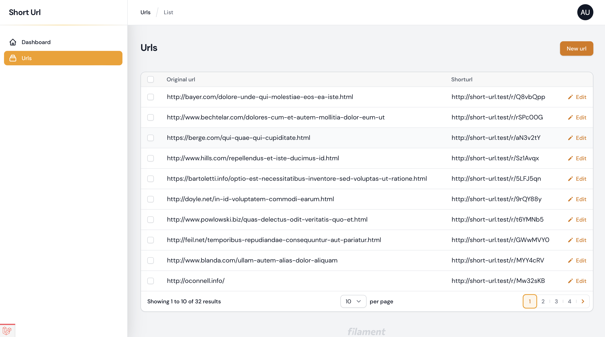
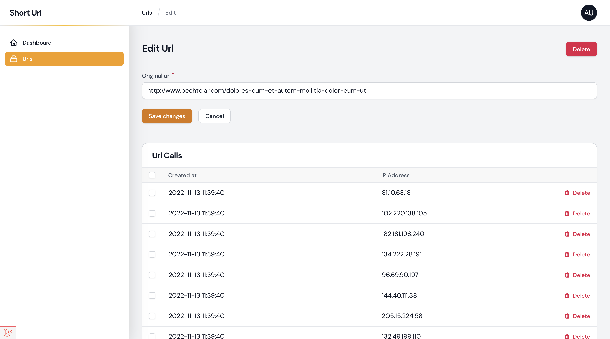
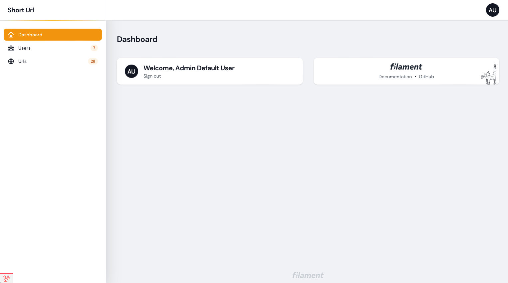

# Short URL

Open source (MIT license) project for creating a self-hosted URL shortener using Docker container

## Installation

### Using Docker

There is a preconfigured .env.docker file you can customize if you want. The Dockerfile install PHP 8.1 with Apache2 and NodeJS.

To use it simply execute:

```
docker compose up 
```

To create the first environment inside the container terminal go in /var/www/html directory and execute `make first_production`

Now you can use admin area and APIs

```
http://localhost:8005/admin
```

### Local installation

You can use this program in any directory you want.

#### Prerequisites

- PHP version 8.1 or above
- composer
- a configured web server or Laravel Valet
- a database

#### Installation Steps

- clone the repository
- put the Document Root to the public directory
- create a .env file (see .env-example for an example file)
- inside the project root execute `make first_production`

This will create the database and download every composer package needed

## Create Users

There is a console command for creating users (both administrators and normal users)

```
php artisan user:create
```

### Configuration

In the env file you can configure:

- SHORT_URL_MAX_LENGTH: the length of the short url string generated
- SHORT_URL_VALIDATE_URL: if the passed Url must be validated via cUrl before saving
- SHORT_URL_CAN_REGISTER_VIA_API: if a user can be registered via API (WARNING: disable for public access server!)


## GUI

You can control everything using the provided administration area, located at `/admin` route.

### Administration

You can list and create the complete URLs for your user in this panel:



Inside the Url detail you can see the complete log calls



For users which are super administration is also possible to create, edit and delete users



## APIs

You can see the OpenApi version of this APIs in OpenAPI.json file

### Registration and Login

To register a new user (normal, not administration user)

/api/register

For obtaining the Bearer Token:

/api/login

Example Input

```
curl --request POST \
--url http://short-url.test/api/login \
--header 'Content-Type: application/x-www-form-urlencoded' \
--data email=mint.dev@pm.me \
--data password=password
```

### Urls API

Protected with Sanctum, so it needs the bearer token obtained via login

| Method | Url           | Note                               | Result Status |
|--------|---------------|------------------------------------|---------------|
| GET    | /api/url      | List all user Urls                 | 200           |
| POST   | /api/url      | Create a new Url and get short url | 201           |
| PUT    | /api/url/<ID> | Modify the Url                     | 200           |
| GET    | /api/url/<ID> | Get information about a single Url | 200           |
| DELETE | /api/url/<ID> | Delete a single Url                | 204           |

#### Create a new Url example

Input:

```json
{
"url":"http://test.com/test"
}
```
